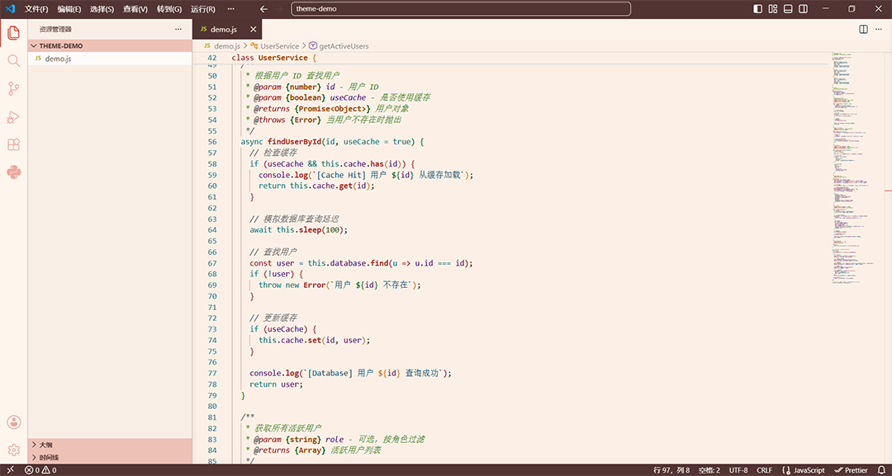

# kazuha-impression-feng-theme 枫原万叶印象主题

## Preview (预览)
Please to `images/preview.png`

click this >>> [Github](https://github.com/XiaoShi-studio/kazuha-impression-theme-maple/) <<<

# English version
下有中文版
> A light VS Code theme based on the impression colors of Kaedehara Kazuha.

## Features
- 1. Use warm white (#fcf0e6) and similar colors as the main tone.
- 2. Use brown (#523532) and similar colors as interactive colors.
- 3. Use the color vermilion (#d13726) and similar hues as accents for interface elements.

## Instructions
Due to the limitations of the agentStatusIndicator, the reason for the commandCenter's Foreground being uncontrollable after activation (forcefully using titleBar.foreground), and the light theme, the display of the command center will have issues for users who enable the built-in AI and agent features.

Specific manifestations include:
- Color switching malfunction during hover
- The text in the command center is illegible

The author spent a long time adjusting but failed, and also tried setting the background color directly to beige. 
Thank you for your understanding!

## How to switch?
### 1. Direct Switch (Recommended):
- Select "Set Color Theme" above the interface

### 2.
- 1. Press <kbd>Ctrl</kbd> + <kbd>K</kbd>
- 2. Press <kbd>Ctrl</kbd> + <kbd>T</kbd> again
- 3. Select this topic in the pop-up options box

Have fun!
Developed by Xiaoshi

# 中文版
> 以枫原万叶印象色为基础的一款VS Code浅色主题。

## 特点
- 1.以 暖白色 (#fcf0e6) 及相近颜色为主色调。
- 2.以 棕褐色 (#523532) 及相近颜色为交互颜色。
- 3.以 朱红 (#d13726) 及相近颜色为界面元素点缀。

## 说明
- 由于 agentStatusIndicator 的限制、不知道为什么启用后commandCenter的Foreground不受控制（强行使用titleBar.foreground），以及浅色主题的缘故，对于启用内置AI功能及智能体的用户来讲，命令中心的显示会出现问题。

具体表现为：
- 悬停时颜色切换故障
- 命令中心文字无法看清

作者调了很久但失败了，也尝试了直接将背景色设为米白，感谢您的谅解！

## 如何切换？
### 1.直接切换 (推荐):
- 在界面上方选择 “设置颜色主题”

### 2.
- 1.按下 <kbd>Ctrl</kbd> + <kbd>K</kbd>
- 2.再按下 <kbd>Ctrl</kbd> + <kbd>T</kbd>
- 3.在弹出的选项框中选择本主题

# 玩得开心！
### 开发 by 小石
---
character designs © miHoYo/HoYovers.
